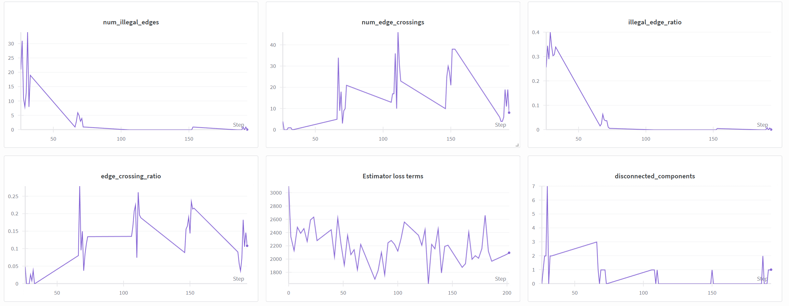
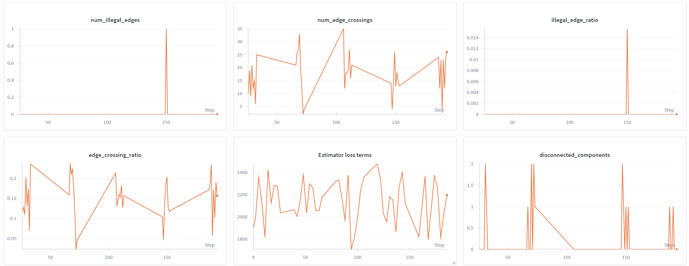
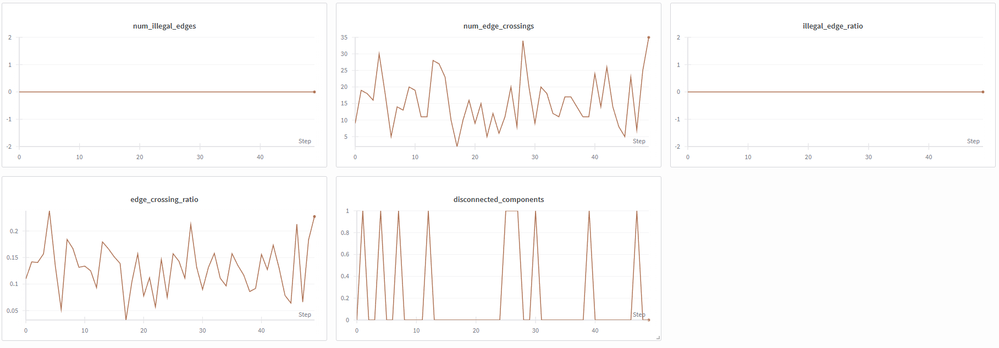
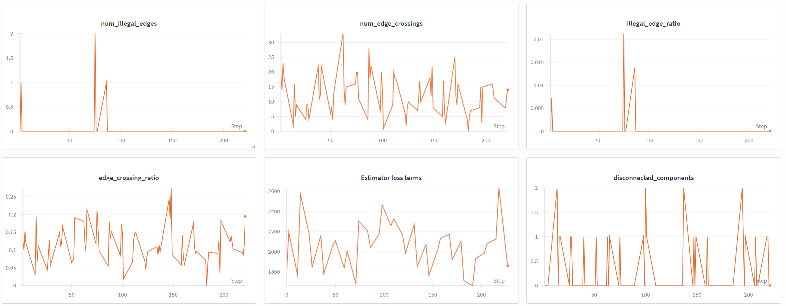
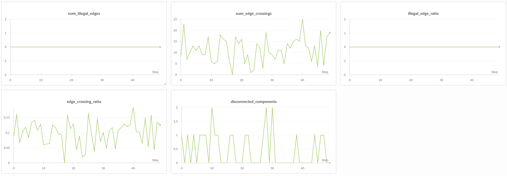
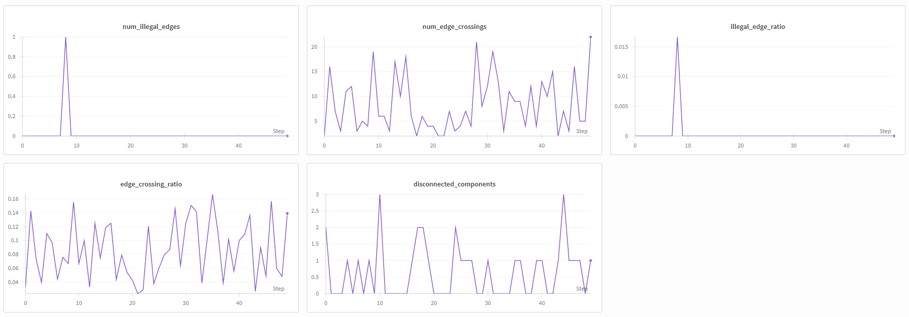

## Negative Sampling Results
### Baseline
+ 100 epochs of regular training
+ serves as basis for finetuning via negative sampling
+ samples generated during first 50 epochs of training
	
+ samples generated during second 50 epochs of training
	
+ 100 samples generated after training
	+ mean edge_crossing_ratio: ~0.0131
	

### Negative Sampling
+ selecting only two negative samples (i.e. one edge) per graph per training step
    + too small loss => no gradient => no learning
    + workaround:
        + selecting up to 16 negative samples (i.e. eight edges)
        + multiplying the loss per edge with a constant factor of 10
+ performing negative sampling always on the last time step 
    + caused the model to very quickly forget which edge lengths are allowed (euclidean distance of $1, \sqrt{2}$ or $\sqrt{5}$)
    + loss during training also remained rather high
    + this already happened after very few epochs of training
    + using the last 200 timesteps instead yielded similar problems although less severe
+ performing negative sampling too often (e.g. for every training step)
    + also caused the model to slowly forget which edge lengths are allowed
    + even for low probabilities, e.g. $p=0.25$ 
        + 25% of training steps negative sampling, 75% regular training
+ using all time steps and a negative sampling probability of $p=0.1$ performed relatively well
    + samples generated during 100 epochs of finetuning
    
    + 100 samples generated after finetuning
	    + mean edge_crossing_ratio: ~0.0998
	    + fewer edge crossings at the cost of more disconnected graphs
    
+ What if we have fewer edge crossings simply because we continued the training for an additional 100 epochs?
    + 100 samples generated after 100 additional epochs of regular training
	    + fewer edge crossings at the cost of more disconnected graphs
	    + mean edge_crossing_ratio: ~0.0858
	    + seems to perform better than negative sampling
	    + could be due to the low sample size, but 100 samples are already quite a lot
		

